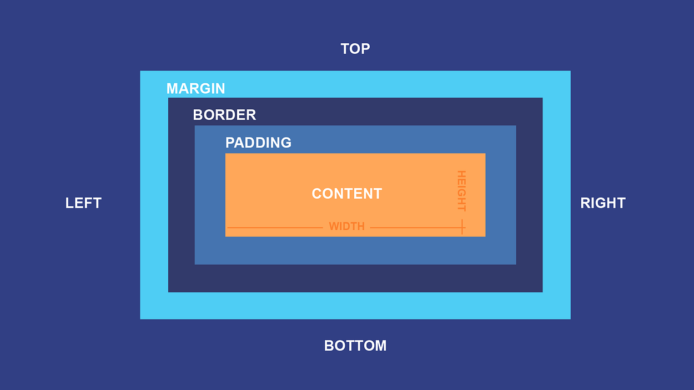
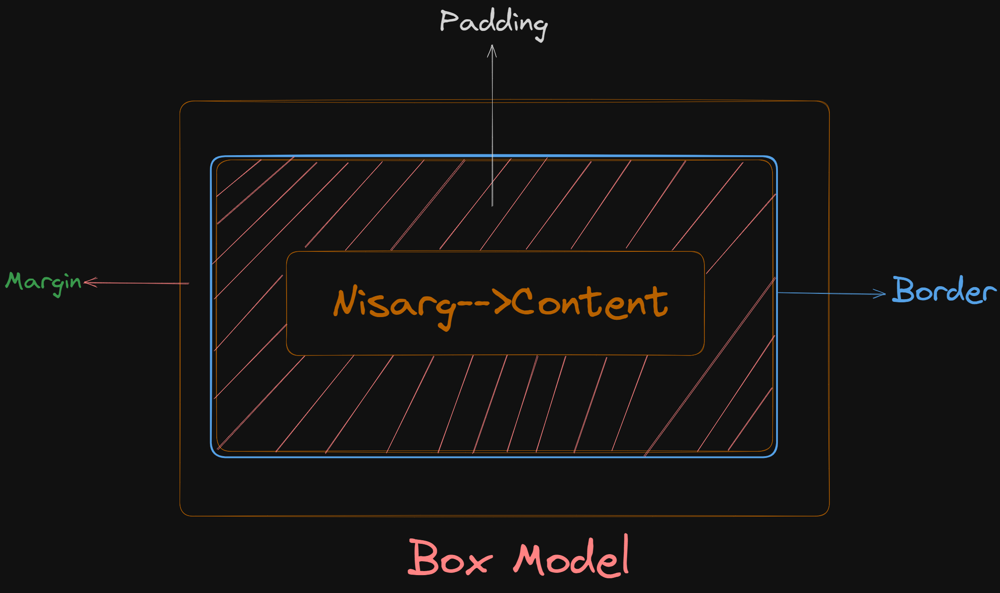

# Box Model


"All HTML elements can be considered as boxes. In CSS, the term "box model" is used when talking about design and layout. The CSS box model is essentially a box that wraps around every HTML element." - [W3Schools](https://www.w3schools.com/css/css\_boxmodel.asp)


The CSS Box Model, consists of five core parts which we’ll cover:

* Border
* Padding
* Margin
* Width
* Height

<figure><figcaption><p>Box Model</p></figcaption></figure>

**Every block-level HTML element you put on a webpage is a box**. Even if it doesn't ordinarily look like it. For example, if you add a `<h1>` element to your webpage and load it, it initially looks like it's just loose text. If you add some CSS colors, though, you can see the rectangle box shape**:**

````html
```html
<h1>Nisarg</h1>
```
````

<figure><figcaption><p>Example of Box Model</p></figcaption></figure>

The Box model defines the different parts of the rectangle above, which are broken up into four(4) pieces, sub-boxes or layers.

1. The innermost rectangle is the **content box**. The width and height of this depend on the element’s content (text, images, videos, and any child elements ).
2. Then we have the **padding box** (defined by the padding property). If there is no padding width defined, the padding edge is equal to the content edge.
3. Next, the **border box** (defined by the border property). If there is no border width defined, the border edge is equal to the padding edge.
4. The outermost rectangle is the **margin box**. If there is no margin width defined, the margin edge is equal to the border edge.

Not all boxes are treated the same in CSS. There’s a difference between "block boxes" and "inline boxes".

#### Block boxes

We already know some ”block boxes” or “block elements”: headlines and paragraphs, navs, headers, and footers. When you add a block element to your page, it starts in its own new line and fills all the available horizontal space.

Each block element sits below the previous block element. Elements are _stacked_ in block direction—by default, that’s from top to bottom. (We can change the default block direction, but this isn’t something we’re going to discuss today…)

#### Inline boxes

“Inline boxes” or “inline elements” sit next to each other in one line. Links, images, and labels are examples for inline elements. When you write text and there are parts you want to highlight with a `strong` tag, the text continues in the same line (but the meaning and styling of the content between the opening and closing tags changes)—this is because the `strong` element is an inline element and thus does not cause a line break.

An inline box grows depending on its content. It gets large enough to fit all its content inside.

## CSS Model with Example

The reason we are talking about block and inline boxes (or elements) separately is that changing their padding, border, or margin properties behaves differently. Let’s have a look at these elements in the browser’s developer tools.

```
// Some code

```

In the screenshot below (I’m using Chrome) you can see the box of the first `h1` headline: the blue area is the element’s **content** and the yellow areas above and below are the top and bottom **margins**. We can also name them `margin-block-start` and `margin-block-end` as our block direction goes from top to bottom.

<figure><figcaption><p>Preview of H1 as Box Model</p></figcaption></figure>

Concerning our h1 and the **Margin** we notice it's 32 pixels actually 32.16 pixels and **we didn't set that so that's a default style on the h1.**

<figure><figcaption><p>H1 Default Browser Style</p></figcaption></figure>

Here are the default styles from the browser this is a **user agent stylesheet** that's **assigned by the browser** and here you can see they assigned some margin settings here it's 0.67em so that's essentially two-thirds now. If I remember about our units an em responds to the font size of the element and we set a font size of 3rem which would essentially be 48 pixels so two-thirds of that is coming in right around where we see it on our box model here at pixels so now that we know our font size is impacting the default margin

### Content and sizing <a href="#content_and_sizing" id="content_and_sizing"></a>

Let's first understand Extrinsic sizing vs intrinsic sizing

**Intrinsic Sizing**: This is like a container that adjusts its size to fit its content naturally. Imagine a box that grows or shrinks to perfectly hold whatever you put inside. It's like a rubber band that stretches or contracts to match what you put in it.

**Extrinsic Sizing**: Here, you decide the size of the container. It's like saying, "I want a box this big, no matter what's inside." You set a fixed size, and the content inside has to adapt to fit that size.


Example of Intrinsic Sizing and Extrinsic Sizing


The demo showcases the text "CSS is awesome" inside a fixed-size box with a bold border. This box is set with a specific width, controlling its child content. However, there's a problem: the word "awesome" is too big for the box and spills beyond its borders. To fix this, we can make the box adapt to the text's size by unsetting the width or using "min-content," which makes the box just as wide as the smallest size needed to contain "CSS is awesome," ensuring a perfect fit.


Key term: When content is too big for the box it is in, we call this overflow. You can manage how an element handles overflow content, using the `overflow` property.


