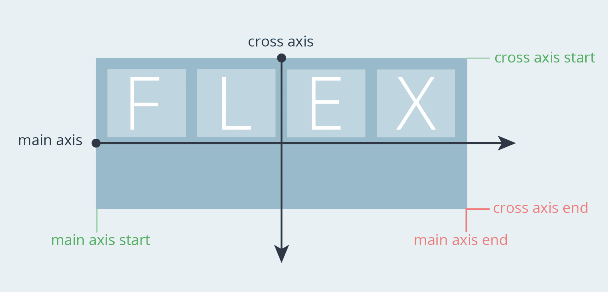

# Flexbox

[Flexbox](https://developer.mozilla.org/en-US/docs/Learn/CSS/CSS\_layout/Flexbox) is a one-dimensional layout system. It helps to organize and arrange elements either in rows or columns. It’s a modern way of aligning and distributing items in a container. A direction-agnostic layout system, Flexbox is used for creating complex applications that require orientation changing, resizing, stretching, shrinking, etc. It can alter the width or height of parent elements to best fill the available space.


Why do we need Flexbox when there is a Grid?

CSS Grid is a great layout mode, but it has a different goal than Flexbox. We should learn both layout modes, and pick the right one for the job.

Flexbox is still the best option for creating dynamic, responsive UIs that arrange items in a row or a column.&#x20;

For example, imagine you want to create a navigation bar that has a logo on the left and some links on the right. You can use Flexbox to easily align the items horizontally and vertically, and make them wrap or shrink depending on the screen size. With CSS Grid, you would need to define a grid template with columns and rows and place the items in the right cells. This is more complicated and less flexible than using Flexbox.


The Flexbox model presents two types of “boxes” – one is the **Flex Container** and the other is the **Flex Item** (direct child – an element within the same container).

In general, you can say that the role of the Flex Container is to group multiple Flex Items together and determine how they are positioned along the container’s axes.

<figure><figcaption><p>Flex Container vs Flex Items</p></figcaption></figure>

```html
<div class="flex-container">
    <div>N</div>
    <div>I</div>
    <div>S</div>
    <div>A</div>
    <div>R</div>
    <div>G</div>
</div>
```

```css
.flex-container {
    display: flex;
}
```

Flexbox allows direct manipulation of those Flex Items (more on that later), but in most cases, it will be the role of the Flex Container to establish the layout.

By adding the `display: flex` property to an element, it practically becomes a Flex Container, and its direct children will become default **Flex Items** arranged in a row.

### Axes in Flexbox

Flexbox work with two axes: The **X-axis**, also known as the **Main-Axis**, and the **Y-axis**, known as the **Cross-Axis**. The main axis is the direction in which the flex items are laid out, and the cross axis is perpendicular to it.&#x20;

<figure><figcaption><p>Flex Direction</p></figcaption></figure>

You can change the main axis by using the `flex-direction` property, which can have four values: `row`, `row-reverse`, `column`, or `column-reverse`.&#x20;

Here’s a breakdown of each value for `flex-direction`:

* `row` – Elements are aligned horizontally along the main axis in the document’s current writing mode.
* `row-reverse` – This value is likewise on the main axis but in reverse of the current writing mode.
* `column` – As the name implies, this flows the flex items along the cross axis (vertically), taking into consideration the current writing mode
* `column-reverse` – Same as `column` but reversed

The cross axis depends on the main axis, so if the main axis is horizontal, the cross axis is vertical, and vice versa.


Flex Direction


### Wrapping

The `flex-wrap` property allows you to determine how and if you want the flex items inside the container to wrap to the next line. The flex-wrap property controls this behavior, and it can have one of the following values:

* **nowrap**: This is the default value, and it means that the flex items will not wrap, even if they overflow the flex container.
* **wrap**: This means that the flex items will wrap onto the next line or column if there is not enough space in the current line or column.
* **wrap-reverse**: This means that the flex items will wrap onto the previous line or column if there is not enough space in the current line or column.

The direction of the wrapping depends on the flex-direction property, which determines the main axis and the cross-axis of the flex container. For example, if the flex-direction is row, then the main axis is horizontal and the cross axis is vertical, and the flex items will wrap into new rows. If flex-direction is a column, then the main axis is vertical and the cross axis is horizontal, and the flex items will wrap into new columns.


Flex Wrap


The main axis and the cross axis have different properties that you can use to align and distribute the flex items. For example, you can use `justify-content` to control the alignment of items along the main axis, and `align-items` to control the alignment of items along the cross-axis. You can also use `flex-wrap` to control how the flex items wrap around the flex container.


